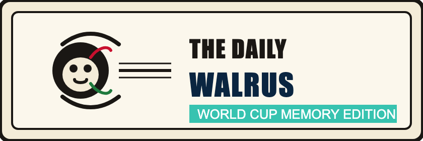
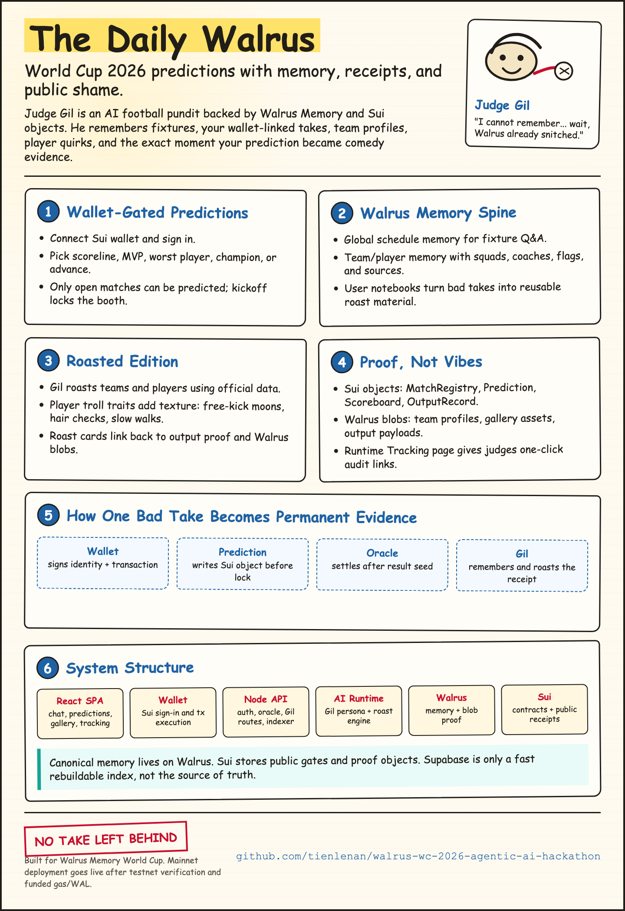
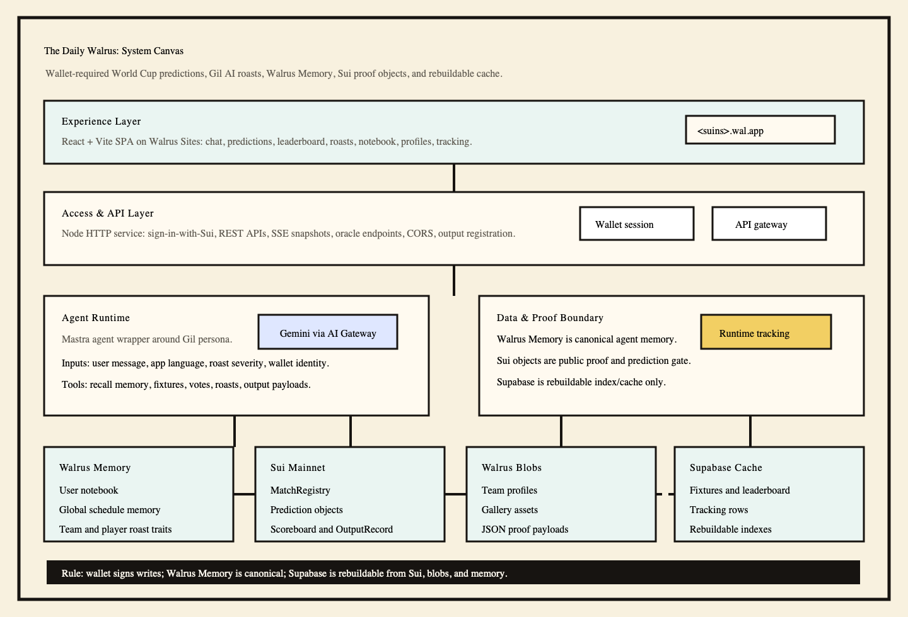
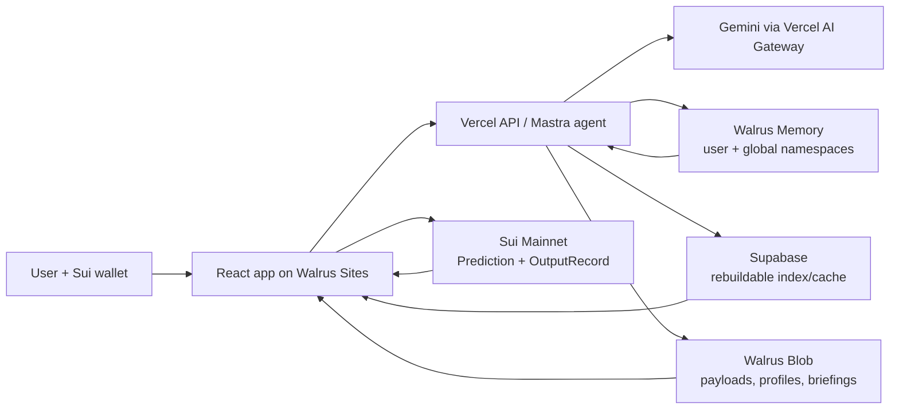
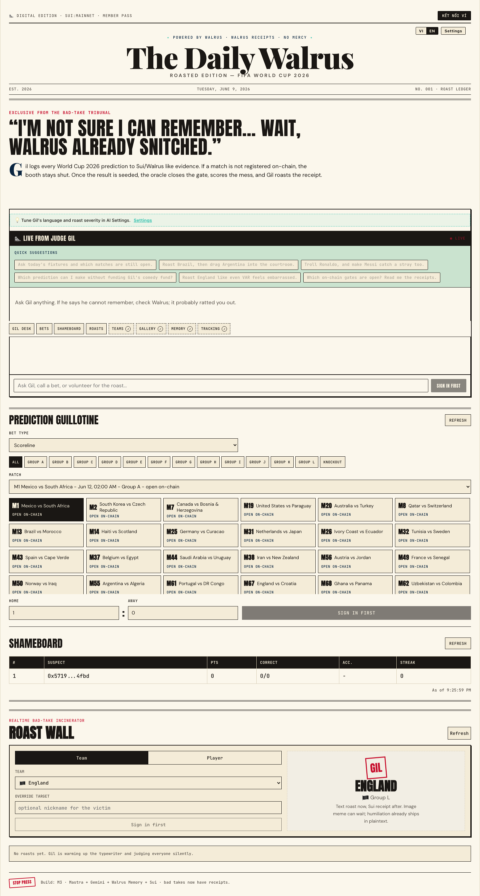
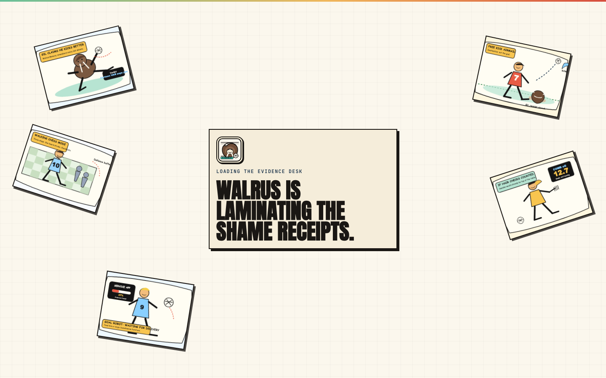
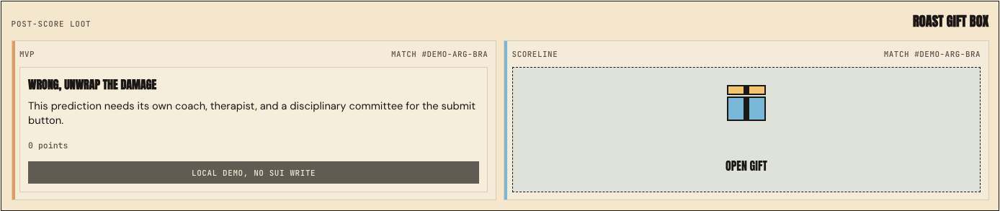

# Gil's VAR Shamebook

<p align="center">
  
</p>

<p align="center">
  <b>A World Cup 2026 roast desk where every prediction gets a receipt.</b><br />
  AI chat, wallet-signed prediction records, Walrus Memory recall, Sui proof objects, and public Walrus Blob receipts.
</p>

<p align="center">
  <a href="https://roast2026wc.wal.app/"><b>Live Walrus Site</b></a>
  ·
  <a href="https://gil-var-shamebook-api.vercel.app/">API</a>
  ·
  <a href="docs/03-architecture.md">Architecture</a>
  ·
  <a href="submission-pack/form/final-submit-cheatsheet.md">Submission Pack</a>
</p>

<p align="center">
  
  
  
  
  
</p>



## What It Is

Gil's VAR Shamebook is a playful World Cup 2026 companion built for the Walrus Memory World Cup and Sui Overflow tracks.
Users connect a Sui wallet, ask Gil about fixtures or teams, make fun prediction picks, reveal roast gifts, and watch their record become permanent evidence.

The joke is simple: Gil forgets nothing because Walrus remembers the receipts.

No gambling, no financial advice, no real-money mechanics. It is a fan commentary game and technical demo for agent memory, Sui signatures, and Walrus storage.

## Why It Stands Out

| Area | What is different |
| --- | --- |
| Memory-first AI | Gil recalls prior predictions, user preferences, player roast traits, team data, and Daily What's Up summaries through Walrus Memory. |
| On-chain proof | Prediction and output actions are wallet-gated and anchored with Sui objects or proof metadata. |
| Walrus-native content | Team profiles, gallery assets, briefings, output payloads, and site hosting are designed around Walrus Blob/Sites. |
| Generative UI | Chat responses can include structured tool-call parts, rendered as fixture cards, team profile cards, proof links, and markdown. |
| Multi-agent publishing | Daily What's Up runs orchestrator, scout, synthesizer, writer, moderator, and publisher steps with anti-duplicate memory. |
| Troll-friendly UX | Newspaper visual system, roast wall, shameboard, gift reveal, gallery, player quirks, and a mascot-led onboarding flow. |

## Product Surface

| Feature | Status | Notes |
| --- | --- | --- |
| Gil Desk | Live | Chat with tool calls for schedule, team profile, memory, and proof lookup. |
| Predictions | Live | Wallet-required picks with open/closed gates from on-chain fixture state. |
| Gift Reveal | Live | Signed reveal flow that returns a roast receipt after prediction outcomes. |
| Shameboard | Live | Fun leaderboard and personal record, indexed for fast UI. |
| Roast Wall | Live | Player/team roasts with shareable receipts. |
| Team Profiles | Live | Flags, coach, squad rows, Walrus Blob links, and fixture context. |
| Gallery | Live | Cartoon troll assets and mascot scenes prepared for Walrus Blob publishing. |
| Daily What's Up | Live | Multi-agent editorial workflow with Walrus Blob payload and briefing memory. |
| Runtime Tracking | Live | Contract IDs, package IDs, memory namespaces, blob/object proof references. |

## Architecture Canvas



## Flow



## Tech Stack

| Layer | Technology |
| --- | --- |
| Frontend | React 19, Vite, TypeScript, Zustand, Streamdown, Mysten dApp Kit |
| Static hosting | Walrus Sites on Sui Mainnet |
| Backend | Node HTTP API on Vercel |
| Agent runtime | Mastra, AI SDK Gateway provider |
| Model | Gemini through Vercel AI Gateway |
| Memory | `@mysten-incubation/memwal` / Walrus Memory |
| Blob storage | `@mysten/walrus`, Walrus CLI, Walrus Blob aggregator/publisher |
| Chain | Sui Move package for match registry, predictions, scoreboard, output records |
| Index/cache | Supabase Postgres, realtime-friendly tables |
| Assets/docs | Submission pack with screenshots, poster, PDF, and design PNGs |

## Mainnet References

| Item | Value |
| --- | --- |
| Public app | <https://roast2026wc.wal.app/> |
| API | <https://gil-var-shamebook-api.vercel.app/> |
| Sui package | `0x2c9496db107257631c4bad0b8f97593a661f82df83b0bd84500bec57d7738beb` |
| MatchRegistry | `0xa992d65237ec8a953f04f0450c39203cc2777b2a67ae61add8c39f74578d3446` |
| Scoreboard | `0xfed0e2738f38965144bdcc840d4bf79ff0c9d75a9afd04753cd4f13c763cec10` |
| Walrus Site object | `0xd7b94c015080b56d9ba19e18112eb69bf5d40dff83158631cd455cd9860c0158` |
| Global schedule memory | `daily-walrus:global:world-cup-2026` |
| Briefing memory | `daily-walrus:global:world-cup-2026:briefings` |

## Repository Map

```text
walrus-memory-world-cup/
├─ apps/
│  ├─ web/        React + Vite app deployed to Walrus Sites
│  └─ server/     Mastra-compatible API, tools, oracle jobs, briefings
├─ packages/
│  ├─ contract/   Sui Move package and generated bindings
│  ├─ db/         Supabase schema, queries, indexes
│  ├─ shared/     shared types, prompts, constants
│  └─ walrus/     Walrus publisher and proof helpers
├─ docs/          architecture, design, deploy runbook, PDF exports
├─ submission-pack/
│  ├─ assets/     poster, screenshots, PDF, logo exports
│  ├─ form/       ready-to-paste submission answers
│  └─ proof/      mainnet object IDs and asset manifest
└─ scripts/       deploy, seed, publishing, verification helpers
```

## Local Development

```bash
pnpm install
cp .env.example .env.local
pnpm dev:web
pnpm dev:server
```

Useful commands:

```bash
pnpm build
pnpm typecheck
pnpm --filter @daily-walrus/server test
pnpm --filter @daily-walrus/server briefings:daily
pnpm deploy:walrus-site
```

For a local mainnet-facing frontend, use the production env mode in `apps/web/env/production`.
For testnet demo recording, use `pnpm dev:web:test`.

## Deploy

Frontend deploy is documented in [docs/mainnet-deploy-runbook.md](docs/mainnet-deploy-runbook.md).

```bash
export PATH="/Users/mpdh/.nvm/versions/node/v22.22.2/bin:/Users/mpdh/.bun/bin:$PATH"
SITE_BUILDER_BIN=/Users/mpdh/.local/share/suiup/binaries/mainnet/site-builder-v2.10.0 \
WALRUS_BINARY=/Users/mpdh/.local/share/suiup/binaries/mainnet/walrus-v1.49.1 \
WALRUS_SITE_CONTEXT=mainnet \
WALRUS_SITE_EPOCHS=12 \
./scripts/deploy-walrus-site.sh
```

Backend deploy runs through Vercel and serves `https://gil-var-shamebook-api.vercel.app/`.

## Submission Assets

| Asset | Path |
| --- | --- |
| Final cheat sheet | [submission-pack/form/final-submit-cheatsheet.md](submission-pack/form/final-submit-cheatsheet.md) |
| Overflow project description | [submission-pack/form/sui-overflow-project-description.md](submission-pack/form/sui-overflow-project-description.md) |
| Airtable answers | [submission-pack/form/airtable-form-answers.md](submission-pack/form/airtable-form-answers.md) |
| Mainnet proof | [submission-pack/proof/mainnet-readiness.md](submission-pack/proof/mainnet-readiness.md) |
| Poster PNG | [submission-pack/assets/posters/poster-sketchnote.png](submission-pack/assets/posters/poster-sketchnote.png) |
| Design PDF | [submission-pack/assets/docs/high-level-design-requirements.pdf](submission-pack/assets/docs/high-level-design-requirements.pdf) |
| Storage/memory PDF | [submission-pack/assets/docs/storage-memory-explainer.pdf](submission-pack/assets/docs/storage-memory-explainer.pdf) |
| Screenshots | [submission-pack/assets/screenshots](submission-pack/assets/screenshots) |

## Design Preview

| Home | Prediction flow | Gift reveal |
| --- | --- | --- |
|  |  |  |

## Status

- Mainnet Walrus Site live.
- Mainnet Sui package deployed.
- 104 World Cup 2026 fixture records registered.
- Team/player profile data published and indexed.
- Daily What's Up workflow implemented with duplicate-avoidance memory.
- Submission materials prepared in `submission-pack/`.

## License

TBD.

<p align="center"><b>Gil's verdict:</b> stored forever, roasted politely, verified on Walrus.</p>
