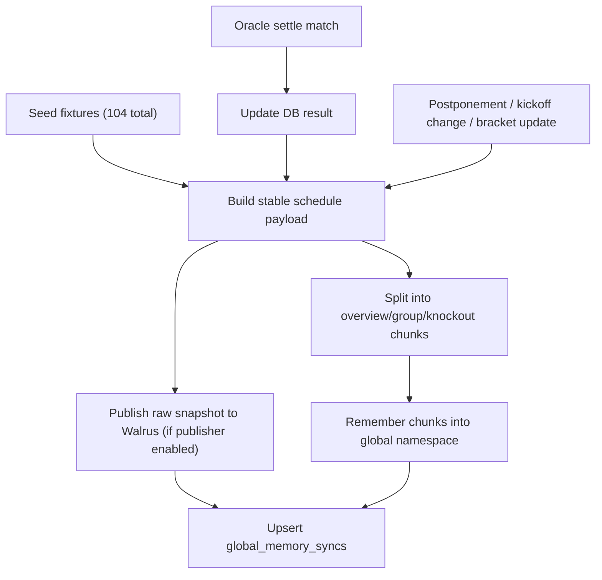

# Runtime Tracking & Global Memory Design

## 1) Goal
- Answer fixture, group, venue, lock-state, and result questions through global memory.
- Keep schedule memory seeded once and re-sync on delay/postponement/round update.
- Provide a public `#tracking` page with one-click links to:
  - Sui objects,
  - Walrus memory/blobs,
  - contract/memory namespaces,
  - and live sync status.

## 2) Data Ownership
| Layer | Responsibility | Read/Write |
|---|---|---|
| Sui `wc_predict` | Source of truth for prediction gate, scoring, and `OutputRecord` proof | Submit prediction / score / settle / output hashes |
| Walrus Memory global | Semantic memory for schedule, lock rules, and fixture status | Memory recall + periodic sync writes |
| Walrus blobs | Optional raw JSON payloads (chat, roast, profile, snapshot) | Write when publisher exists |
| Supabase | Rebuildable index/cache, tracking metadata, leaderboard, fixture query | Cache + fast queries |

## 3) Namespaces
- Per-user memory: `daily-walrus:<suiAddress>`
- Global memory: `daily-walrus:global:world-cup-2026`
- Both namespaces are loaded before generating replies:
  - Global memory for schedule/results rules
  - User memory for behavior history and roast context

## 4) Sync Workflow

## 5) Prediction Gate
- `fixtures.chain_registered = false`: schedule view only, no prediction action.
- `chain_registered = true` + kickoff future + not finished: prediction open.
- After kickoff passed or fixture finished: prediction locked.
- `settle_match` updates DB result, emits events, and triggers best-effort global memory sync.

## 6) Tracking API
Endpoint: `GET /api/tracking/runtime`

Returns:
- Sui network + explorer URLs.
- Contract object IDs and oracle ids.
- Memory service status + namespace + last sync hash.
- Walrus publisher status and object/blob URLs (if configured).
- Fixture counters (`total`, `registered`, `open`, `not_onchain`, `closed`, `finished`).
- Source URLs for schedules and squad data.

Admin endpoint:
`POST /api/oracle/memory-sync` with `X-Oracle-Token`.

## 7) UI Tracking Page
Route: `#tracking` in SPA.

Use cases:
- Open Sui explorer objects quickly.
- Open Walrus object/blob URL for memory proof.
- Copy contract/object IDs and namespace.
- Confirm writing state (live, not just cache mode).

## 8) Operational Notes
- Missing `MEMWAL_ACCOUNT_ID` or `MEMWAL_DELEGATE_KEY` shows `memory_not_configured`.
- Missing `WALRUS_PUBLISHER_URL` shows `not_configured` for raw blob fields; `OutputRecord` proof still works on Sui.
- `global_memory_syncs` is tracking metadata, not canonical memory.
