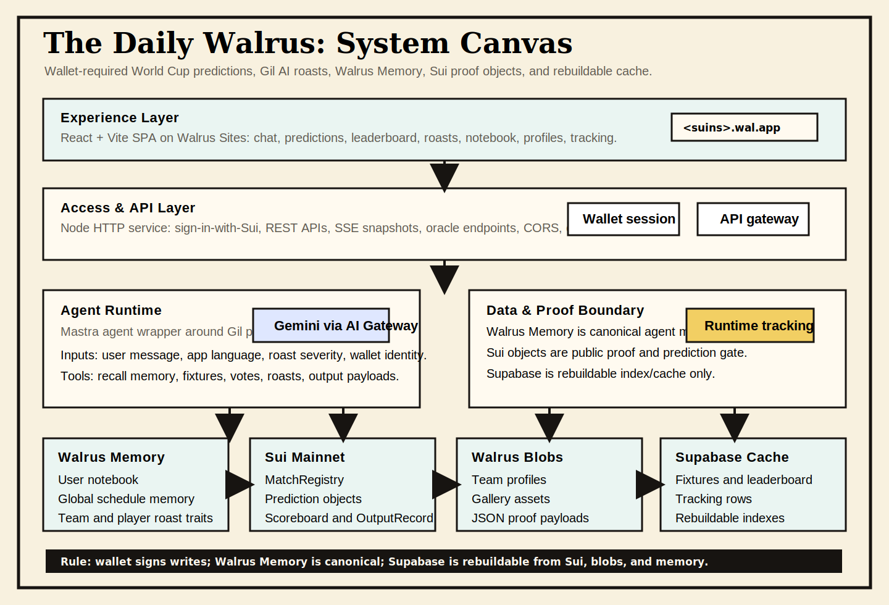
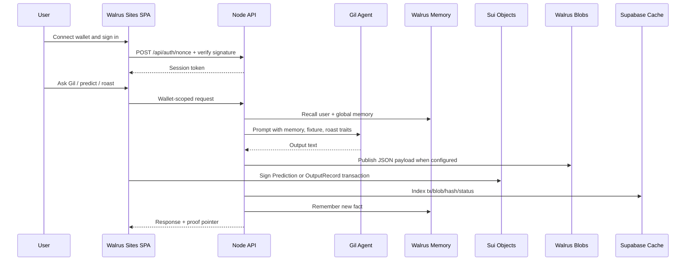
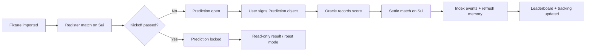

# The Daily Walrus - High-Level System Design

## 1. Purpose
The Daily Walrus is a wallet-gated World Cup 2026 prediction and roast app. Users connect a Sui wallet, ask Gil about fixtures, submit predictions, and get roasted with memory-backed context.

The design goal is simple: every important output should be traceable through Sui objects, Walrus Memory, Walrus blobs, or a rebuildable index.

## 2. Architecture Canvas

## 3. System Layers
| Layer | Components | Responsibility | Interface |
|---|---|---|---|
| Experience | React/Vite SPA, wallet UI, predictions, leaderboard, roast wall, notebook, tracking | User workflows and proof links | Browser, wallet adapter, REST/SSE |
| Access and API | Node HTTP server, auth nonce/verify, oracle endpoints, CORS | Validates wallet identity and routes app actions | `GET/POST /api/*` |
| Agent runtime | Mastra/Gil wrapper, prompt context, roast engine, fixture tools | Builds AI context and produces chat/roast outputs | AI Gateway, memory recall, app services |
| Memory | Walrus Memory namespaces | Canonical semantic memory for users and global WC knowledge | `remember`, `recall`, `rememberBulk` |
| On-chain proof | Sui Move package: registry, predictions, scoreboard, output records | Prediction gates, settlement, public proof objects | Sui transactions/events |
| Blob proof | Walrus blobs | Raw JSON payloads, team profiles, gallery assets, memory snapshots | Aggregator URL and blob IDs |
| Cache/index | Supabase/Postgres | Fast reads, leaderboard, runtime status, rebuildable indexes | SQL, realtime/polling |

## 4. Component Boundaries
### Frontend
- Owns layout, language switch, settings, wallet session UX, and reference pages.
- Does not hold secrets.
- All write actions require a verified wallet session before calling the server.

### Server
- Owns auth verification, Gil context assembly, memory sync, Sui helper calls, scoring, and tracking API.
- Provides a thin HTTP surface rather than putting business logic in the browser.
- Keeps raw output hashes and blob pointers aligned with Sui `OutputRecord` objects.

### Walrus Memory
- Stores user notebook facts under `daily-walrus:user:<sui-address>`.
- Stores global World Cup knowledge under `daily-walrus:global:world-cup-2026`.
- Current global memory kinds:
  - `world_cup_schedule`
  - `world_cup_teams`
  - `player_roast_traits`

### Sui Contract
- `MatchRegistry`: fixture registration and prediction gate state.
- `Prediction`: user-owned prediction objects.
- `Scoreboard`: scoring and leaderboard source events.
- `OutputRecord`: user-owned proof pointer for chat/roast/vote outputs.

### Supabase
- Cache only. It supports UX speed, filtering, and tracking views.
- It is not canonical memory and should be rebuildable from Walrus/Sui evidence.

## 5. Communication Flow

## 6. Prediction Gate Flow

## 7. Memory Spine
| Memory kind | Scope | Input | Used by |
|---|---|---|---|
| User notebook | Per wallet | User messages, predictions, roasts | Personalized Gil chat and roasts |
| Schedule memory | Global | Fixture schedule, kickoff, venue, gate status | Fixture Q&A and prediction lock explanations |
| Team/player memory | Global | Team profiles, coach, squad list | Team profile page and Gil context |
| Player roast traits | Global | Public on-field meme traits with avoid rules | Player roasts and Gil chat |

The player roast layer separates facts from jokes. `evidence` stores sourced context, `roastAngles` stores safe comedic angles, and `avoid` prevents Gil from turning a meme into a private or defamatory claim.

## 8. Runtime Tracking Contract
Tracking page must answer:
- Which network is active.
- Which Sui package/object IDs are in use.
- Which Walrus blob IDs are attached to global data.
- Whether MemWal account/delegate keys are configured.
- How many fixtures are registered/open/settled.
- Whether team memory and player roast memory are synced.

Current testnet proof:
- Fixtures: 104 total, 104 registered, 103 open, 1 settled.
- Player roast memory: 8 player docs synced.
- Player roast blob: `TFT-5KpH07fTI83PdZ_i6869RNzG2aj_d_YxbiBjSHw`.
- Player roast object: `0x6c5c938a0a04b190498ce19253a0caf27b86e4a592381cc7f3cb249f7ed8312a`.

## 9. Mainnet Migration Order
1. Fund deploy wallet with mainnet SUI and WAL.
2. Publish Sui Move package.
3. Register all fixtures on mainnet.
4. Publish team profiles, player roast traits, gallery assets, and schedule payloads to Walrus mainnet blobs.
5. Sync global memory on mainnet MemWal.
6. Deploy SPA to Walrus Sites mainnet.
7. Attach SuiNS/wal.app domain.
8. Smoke test wallet writes, predictions, roasts, output records, and tracking.
9. Replace all submission placeholders with mainnet IDs and URLs.

## 10. Non-Goals
- Supabase is not a canonical memory store.
- Testnet IDs are not final submission proof.
- Gallery and poster assets are proof/media layers, not prediction authority.
- The AI is not allowed to invent private facts about real players.
