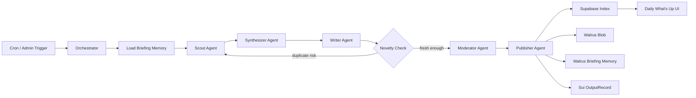

# Overflow 2026 Agentic Walrus Brief

## Positioning

Primary track: **Special - Walrus**.

Secondary narrative: **Agentic Web** through an autonomous publishing workflow.

The app remains **Gil's VAR Shamebook**. The Overflow addition is **Daily
What's Up**: Gil's newsroom now publishes verifiable World Cup dispatches
using a multi-agent pipeline backed by Walrus Blob, Walrus Memory, and Sui proof
objects.

## Workflow

The editorial memory path is `daily-walrus:global:world-cup-2026:briefings`.
Before writing, the workflow loads recent summaries and source IDs. After writing,
it computes a novelty score. Duplicate-risk drafts are rejected and re-scouted up
to three attempts.

## Proof Model

| Layer | Stored data |
|---|---|
| Walrus Blob | Full public dispatch JSON and markdown |
| Walrus Memory | Short summary metadata for global recall and anti-repeat writing context |
| Sui OutputRecord | Optional publisher-owned `blobId + contentHash` receipt |
| Supabase | Rebuildable UI index and run ledger |

## Demo Path

1. Open `#briefings` / Daily What's Up.
2. Show latest article and source list.
3. Expand agent trace.
4. Point out `previousBriefings`, novelty score, and any retry rows.
5. Open Walrus blob from proof strip.
6. Open `#tracking` and show latest dispatch status.
7. Ask Gil what today's Daily What's Up said; Gil should recall from global memory when MemWal is configured.

## Latest Mainnet Proof

- Blob: `g83hrVh7U-V2olfyUsvECGFnLTeaFKKhwA0BGXeMgn4`
- Object: `0xcdac7bf4884ebdecb01cfef0078c9585078142718d77b017441e01a677a4d3a3`
- Content hash: `529cf6132e7ca253f0f86fe02dc9cf2b4edc69a1b52cb394cfdcd5d660d5d7c1`
- Sui receipt: `5YLPQ17mtzSLEQ5o7CH7LqDos351HHr5VKKEnTJRR28`
- Novelty: loaded `1` previous briefing, score `0.025`, duplicate `false`
