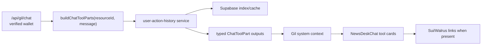

# Gil Dapp Action Tool Coverage

## Overview

Gil currently answers schedule/team questions well, but user-specific dapp recall is under-tooled.
The agent only exposes structured cards for fixtures and team profiles. Prediction facts are injected
as memory text, roasts are remembered loosely, and dapp actions are spread across `predictions`,
`roasts`, `match_votes`, `sui_output_records`, and `game/snapshot`.

This plan adds identity-scoped tools so Gil can answer:

- "toi da du doan gi?"
- "toi da roast ai?"
- "nhung hanh dong toi da lam trong dapp?"
- "receipts/proofs cua toi nam o dau?"
- "toi da vote MVP/worst player chua?"

No Move redeploy by default. No provider/live-data work. Supabase remains a rebuildable index/cache;
Sui and Walrus remain proof/payload layers.

## Scope Challenge

- Existing code: `getFixtures` and `getTeamProfile` tools exist; `chat-render-parts.ts` prefetches
  deterministic tool cards; `chatWithGil` injects prediction facts from DB/Walrus Memory.
- Minimum changes: add private query service, route intents, add render DTOs/cards, test the user
  questions. Do not add new schema unless full chat transcript recall becomes required.
- Complexity: touches backend services/tools plus chat UI; modularize because `news-desk-chat.tsx`
  and `chat-render-parts.ts` are already large.
- Selected mode: HOLD SCOPE.

## Current Gap

| Question | Current behavior | Needed behavior |
|---|---|---|
| What did I predict? | Memory text may mention predictions, no explicit tool card | `getMyPredictions` card with match, pick, result, points, tx |
| What did I roast? | Roasts stored/listed globally, not private tool | `getMyRoasts` scoped to wallet `resource_id` |
| What have I done in dapp? | No unified action timeline | `getMyDappActions` merges predictions, roasts, votes, output records |
| Where are my proofs? | Proof registration exists, no read tool | `getMyOutputRecords` with Sui object/tx/blob/hash |
| Did I vote MVP/worst? | Snapshot has vote summaries, no direct chat tool | `getMyMatchVotes` scoped to wallet |

## Target Tool Set

| Tool | Source tables/services | Access rule |
|---|---|---|
| `getMyGameRecord` | `users`, `leaderboard`/derived stats | verified wallet only |
| `getMyPredictions` | `predictions` join `fixtures` | verified wallet only |
| `getMyRoasts` | `roasts` where `resource_id = wallet` | verified wallet only |
| `getMyMatchVotes` | `match_votes` join `users`/`fixtures` | verified wallet only |
| `getMyOutputRecords` | `sui_output_records` join `users` | verified wallet only |
| `getMyDappActions` | unified timeline from all above | verified wallet only |

Security rule: never let the model or user text choose another wallet address. `resourceId` comes
from the verified session inside `/api/gil/chat`.

## Architecture Summary

## Not In Scope

- Full chat transcript replay. Existing `sui_output_records` can prove chat outputs, but not full
  message bodies unless a future privacy decision adds a `chat_turns` index.
- Querying another wallet by address.
- New scoring logic, Move changes, provider/live-match work.
- Replacing Walrus Memory. Structured tools supplement memory; they do not become the memory layer.

## Phases

| Phase | Name | Status |
|-------|------|--------|
| 1 | [Current Contracts And Query DTOs](./phase-01-current-contracts-and-query-dtos.md) | Completed |
| 2 | [Backend Action Tools](./phase-02-backend-action-tools.md) | Completed |
| 3 | [Chat Routing And Render Parts](./phase-03-chat-routing-and-render-parts.md) | Completed |
| 4 | [Frontend Tool Cards](./phase-04-frontend-tool-cards.md) | Completed |
| 5 | [Evaluation And Documentation](./phase-05-evaluation-and-documentation.md) | Completed |

## Dependencies

- Reuses `plans/260608-public-multiuser-sui-memory`: users, predictions, scoring, roasts,
  output records, vote summaries.
- Does not block `plans/260610-1657-wc-live-admin-data-ops`; live match tools can be added later
  using the same render pattern.
- Depends on current `/api/gil/chat` verified session flow; no anonymous private tool calls.

## Success Criteria

- Gil returns structured tool cards for prediction history, roast history, proof records, match
  votes, and a unified dapp timeline.
- Tool answers are wallet-scoped and cannot query arbitrary addresses.
- Empty states are explicit: "no predictions yet", "no roasts yet", "no proofs yet".
- Existing fixture/team profile tool cards continue to render.
- Server typecheck, web typecheck, server tests, and chat eval prompts pass.

## Unresolved Questions

- None for this plan. Full chat transcript recall is intentionally deferred unless requested.
