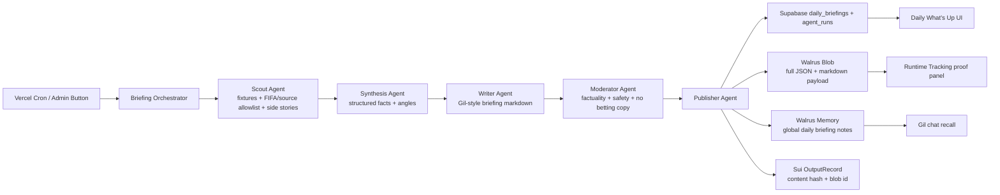

# Overflow Agentic Daily What's Up

## Overview

Add a new **Daily What's Up / Boi tin** product surface without renaming the app.
The feature turns the current Gil chat + fixture memory into a repeatable agentic
publishing workflow:

1. an orchestrator starts a daily or post-match run,
2. a scout gathers fixture state plus allowed public World Cup context,
3. a synthesizer converts raw inputs into structured facts,
4. a content writer produces a Gil-style article,
5. a moderator verifies safety and factuality,
6. a publisher saves the article, writes proof payloads to Walrus, updates global
   Walrus Memory, and anchors the content hash through a Sui `OutputRecord`.

This keeps the Overflow story focused on **Special - Walrus** while showing a
clear **Agentic Web** workflow. Supabase remains a rebuildable index/cache; Walrus
and Sui hold the verifiable memory/proof layer.

## Scope Challenge

- Keep the current app name and brand. Add a feature surface, not a product rename.
- Do not redeploy Move unless absolutely required. Reuse `submit_output_record`
  with `OutputKind.ProfilePointer` for publisher-owned briefing receipts.
- Do not build an open-ended news crawler. Use an allowlisted source adapter:
  current fixture/team/player cache, official FIFA schedule source, configured
  RSS/HTML URLs, and optional provider adapters. Store source URLs and short
  extracted facts, not copied article bodies.
- Do not make every agent a separate service. A single backend workflow with
  explicit role prompts, typed inputs, and persisted `agent_runs` is enough for
  judging and maintenance.

## Phases

| Phase | Name | Status |
|-------|------|--------|
| 1 | [Architecture & Data Contracts](./phase-01-architecture-data-contracts.md) | Completed |
| 2 | [Multi-Agent Workflow](./phase-02-multi-agent-workflow.md) | Completed |
| 3 | [Walrus Proof Publishing](./phase-03-walrus-proof-publishing.md) | Completed |
| 4 | [Daily What's Up UI](./phase-04-daily-briefings-ui.md) | Completed |
| 5 | [Automation & Admin Controls](./phase-05-automation-admin-controls.md) | Completed |
| 6 | [Verification & Submission Docs](./phase-06-verification-submission-docs.md) | Completed |

## Dependencies

- Blocks `plans/260610-mainnet-deployment-and-submission` because the submission
  pack must include the new Overflow positioning, screenshots, proof links, and
  demo script after this feature lands.
- Reuses existing primitives from `plans/260608-public-multiuser-sui-memory`:
  fixture cache, team/player profiles, Walrus Memory namespace strategy,
  prediction gates, `sui_output_records`, and runtime tracking.

## Target Architecture

## Success Criteria

- `/api/briefings/latest` returns a published briefing with article content,
  source list, agent trace summary, Walrus pointer fields, and optional Sui receipt.
- `POST /api/oracle/briefings/run` creates or refreshes the daily briefing with
  idempotency by date/type.
- The web app shows a dedicated Daily What's Up page and a homepage teaser.
- Gil chat can answer questions about the latest briefing because global Walrus
  Memory is updated.
- Runtime tracking exposes latest briefing proof: blob, object, hash, memory
  status, and publisher receipt status.
- Submission docs/screenshots explain this as an autonomous Walrus memory workflow.

## Risks

- Public news source volatility: mitigate with allowlist, short extraction, and
  graceful fallback to schedule/team cache.
- LLM hallucination: require structured scout facts, writer must cite source IDs,
  moderator rejects unsupported claims.
- Publisher wallet/gas unavailable: DB publish still works, Walrus status is
  explicit, Sui receipt is `not_configured` instead of silently claimed.
- Copyright/IP risk: store facts and links only; never store full third-party
  articles or real-player defamatory claims.
